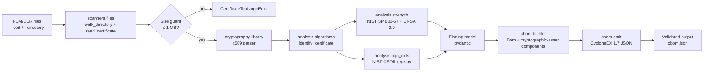

<p align="center"></p>

<p align="center">[](LICENSE) [](pyproject.toml) [](https://cyclonedx.org/docs/1.7/json/) [](https://github.com/qtonicquantum/pqc-readiness-cli/actions/workflows/ci.yml) [](https://github.com/qtonicquantum/pqc-readiness-cli/actions/workflows/codeql.yml) [](#test-coverage)</p>

# pqc-readiness-cli — leading quantum risk and vulnerability intelligence tools and services

Local cryptographic asset inventory CLI from Qtonic Quantum. Reads PEM/DER certificate files you point it at and emits a CycloneDX 1.7 Cryptography Bill of Materials (CBOM) describing the cryptographic primitives, key sizes, and OIDs found.

The CLI is the asset-inventory front-door. It pairs with QScout, QStrike, QSolve, and Q-Lab as the file-level inventory layer. For network discovery, exploitability validation, and migration execution refer to https://qtonicquantum.com.

## What Qtonic Quantum does

**We take enterprises from current cryptographic state, through hybrid, to post-quantum.**

Four pillars deliver the journey:

- **QScout** — cryptographic assessment (current-state discovery and risk scoring)
- **QStrike** — governed follow-on validation (proves what is exploitable)
- **QSolve** — PQC migration (executes the move to hybrid then post-quantum)
- **Q-Lab** — independent public scoring registry (credentials the work)

### Why Qtonic Quantum

- **Leading intelligence tools** — credentialed by our own public Q-Lab scoring registry, not vendor self-reports.
- **Our own labs** — Q-Lab is built and operated in-house.
- **Founder-funded and independent** — no outside funding, no vendor distribution agreements. 100% vendor neutral, client focused.

---

## Install

From source (until the first PyPI release):

```bash
git clone https://github.com/qtonicquantum/pqc-readiness-cli.git
cd pqc-readiness-cli
pip install -e .
```

After the first PyPI release:

```bash
pipx install pqc-readiness-cli
# or
uv tool install pqc-readiness-cli
```

## Quick Start

The CLI exposes three commands: `inventory`, `algorithms`, and `version`.

```bash
# Show top-level help
pqc-readiness --help

# Show inventory subcommand help
pqc-readiness inventory --help

# Inventory a single PEM/DER certificate file
pqc-readiness inventory --cert path/to/cert.pem --output cbom.json

# Inventory every PEM/DER certificate in a directory tree
pqc-readiness inventory --directory ./certs --output cbom.json

# Stream the CBOM to stdout
pqc-readiness inventory --cert path/to/cert.pem
```

The output is a CycloneDX 1.7 CBOM document. Validate it against the schema bundled with `cyclonedx-python-lib`:

```bash
pip install cyclonedx-python-lib jsonschema
python3 -c "
import json, jsonschema, cyclonedx
from pathlib import Path
schema = json.loads(sorted((Path(cyclonedx.__file__).parent / 'schema' / '_res').glob('bom-1.7*.schema.json'))[0].read_text())
bom = json.loads(open('cbom.json').read())
errs = list(jsonschema.Draft7Validator(schema).iter_errors(bom))
print('PASS' if not errs else f'FAIL: {len(errs)} error(s)')
"
```

## Demo: what a real run looks like

```text
$ pqc-readiness inventory --cert tests/fixtures/rsa-2048.pem --output cbom.json
INFO pqc_readiness: wrote CBOM to cbom.json (1 finding(s), 0 error(s))

$ jq '{specVersion, components: [.components[] | {name, version, oid: .cryptoProperties.oid, assessment: (.description | capture("assessment=(?<v>[^|]+)") | .v | rtrimstr(" "))}]}' cbom.json
{
  "specVersion": "1.7",
  "components": [
    {
      "name": "tests/fixtures/rsa-2048.pem",
      "version": "RSA",
      "oid": "1.2.840.113549.1.1.1",
      "assessment": "legacy"
    }
  ]
}
```

The `assessment` field follows NIST SP 800-57 Rev 5 thresholds:
`pqc-ready` (ML-KEM/ML-DSA/SLH-DSA) · `cnsa-2030` (CNSA 2.0 minimum) · `nist-2030` (NIST 2030 minimum) · `legacy` (below NIST 2030) · `weak` (broken or imminent) · `unknown` (not classified — manual review required).

## What it detects

| Algorithm | Detection method | Standard |
|-----------|------------------|----------|
| RSA (any bit length) | OID `1.2.840.113549.1.1.1` via `cryptography.x509` | NIST SP 800-57 Rev 5 |
| ECDSA (P-256, P-384, P-521) | OID `1.2.840.10045.2.1` + curve name | NIST SP 800-57 Rev 5 |
| Ed25519, Ed448 | OIDs `1.3.101.112`, `1.3.101.113` | RFC 8032 |
| ML-KEM (512, 768, 1024) | OIDs `2.16.840.1.101.3.4.4.{1,2,3}` | NIST FIPS 203 |
| ML-DSA (44, 65, 87) | OIDs `2.16.840.1.101.3.4.3.{17,18,19}` | NIST FIPS 204 |
| SLH-DSA (12 parameter sets, FIPS 205) | OIDs `2.16.840.1.101.3.4.3.{20-31}` | NIST FIPS 205 |

OID source: NIST CSOR — https://csrc.nist.gov/Projects/Computer-Security-Objects-Register

## How it works



No `subprocess` calls to external crypto binaries. No network access in v0.1.0. Self-scan only.

## Strength assessment

The strength analysis labels each finding using NIST SP 800-57 Rev 5 thresholds:

| Label | Meaning |
|-------|---------|
| `pqc-ready` | Algorithm is one of ML-KEM, ML-DSA, SLH-DSA |
| `cnsa-2030` | Meets the CNSA 2.0 minimum (e.g. RSA-3072+, ECDSA-P384+) |
| `nist-2030` | Meets the NIST 2030 minimum but below CNSA 2.0 |
| `legacy` | Below the NIST 2030 minimum (e.g. RSA-2048) |
| `weak` | Cryptographically broken or imminent (e.g. RSA-1024) |

## CycloneDX 1.7 output

Output is a single JSON document with `bomFormat: "CycloneDX"`, `specVersion: "1.7"`, fresh `serialNumber` URN UUID, and one `cryptographic-asset` component per detected primitive. Reference examples for nginx, openssl, OpenJDK, python-venv, go-binary, and node-app live in https://github.com/qtonicquantum/cbom-cyclonedx-examples.


## Test coverage

The CLI ships with **60 tests** (unit, integration, regression, and Hypothesis property tests) at **90.91% line coverage**, with a 90% floor enforced in CI.

Reproduce locally:

```bash
git clone https://github.com/qtonicquantum/pqc-readiness-cli.git
cd pqc-readiness-cli
pip install -e ".[dev]"
python -m pytest -q
```

The matrix in `.github/workflows/ci.yml` runs the same test suite across Python 3.10/3.11/3.12/3.13 and Ubuntu/macOS/Windows on every push.

## Verify the release

Every release on this repository is signed with [Sigstore](https://www.sigstore.dev/) using GitHub OIDC. The release-time identity binds the artifact to this repository's release workflow at the tagged commit, so a verifier can confirm the wheel and tarball were built from this exact source tree.

Verify `v0.1.0` end-to-end:

```bash
pip install sigstore
gh release download v0.1.0 --repo qtonicquantum/pqc-readiness-cli --dir release-v0.1.0
cd release-v0.1.0
python -m sigstore verify github \
  --bundle pqc_readiness_cli-0.1.0-py3-none-any.whl.sigstore.json \
  --cert-identity 'https://github.com/qtonicquantum/pqc-readiness-cli/.github/workflows/release.yml@refs/tags/v0.1.0' \
  pqc_readiness_cli-0.1.0-py3-none-any.whl
```

The same identity is bound to the source tarball and to a build-provenance attestation queryable via `gh api repos/qtonicquantum/pqc-readiness-cli/attestations/sha256:<digest>`.

## Documentation

- [Methodology](docs/METHODOLOGY.md) — what gets detected and how
- [Limitations](docs/LIMITATIONS.md) — explicit list of what this CLI does NOT do
- [Architecture](docs/ARCHITECTURE.md) — module map
- [Examples](docs/EXAMPLES.md) — runnable inventory examples

## Limitations

This CLI is a **local file inventory tool**. It does NOT do network scanning, TLS endpoint probing, SSH host-key enumeration, exploitability assessment, or cryptographic exfiltration. For those refer to https://qtonicquantum.com — QScout (assessment), QStrike (governed validation), QSolve (migration).

See [docs/LIMITATIONS.md](docs/LIMITATIONS.md) for the full list.

## Security

See [SECURITY.md](SECURITY.md). Report sensitive issues to ciso@qtonicquantum.com.

## License

MIT — see [LICENSE](LICENSE).

---

From Qtonic Quantum — leading quantum risk and vulnerability intelligence tools and services. Visit https://qtonicquantum.com.
